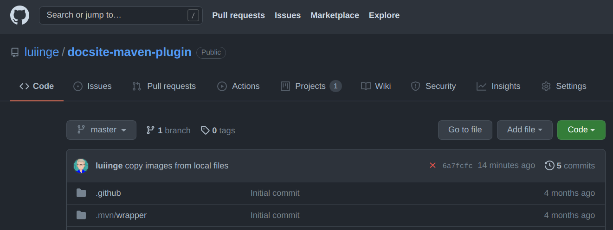
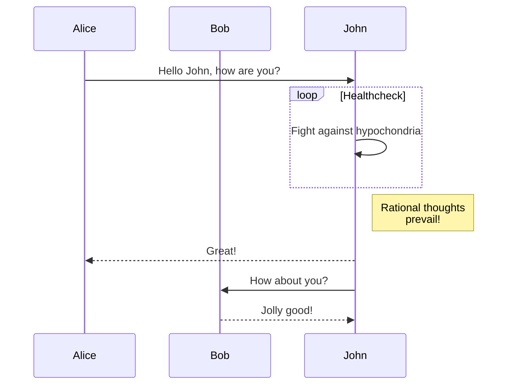

jExt
================================================================================


[](https://sonarcloud.io/dashboard?id=luiinge_jext)


jExt is a simple library that allows you to define a *plug-in* architecture detecting the
Java classes that implements a specific interface. It mostly relies on the standard
[extension mechanism provided][1] by Java by means of the [ServiceLoader][2]
class, but it simplifies and enhances the usage.

The key concepts are:

- **Extension points** (interfaces annotated with `@ExtensionPoint`) which define the contract
- **Extensions** (classes annotated with `@Extension` and implementing the extension point class)
- **Extension loaders** that are responsible of discovering extensions for an specific extension point

> This is a quote block
> that should be rendered in a different style


What is the extra value then?

- Annotation processing of `@Extension` and `@ExtensionPoint` so the classes are
automatically registered as services by the compiler
- Capability of using multiple class loaders at the same time
- Use the default `ServiceLoader` mechanism or provide your own discoverer from a IoC framework
- Explicitly declaring the extension point version that implement each extension,
avoiding using wrong jar versions
- Custom control about creating new extension instances or reusing existing ones
- When extending an extension via inheritance, you may either override the parent class or
use both superclass and subclass independently

<p align="center"></p>


Usage
-----------------------------------------------------------------------------------------

### Maven dependency
Include the following within the `<dependencies>` section of your `pom.xml` file:
```xml
<dependency>
    <groupId>io.github.luiinge</groupId>
    <artifactId>jext</artifactId>
    <version>1.0.0</version>
</dependency>
```

### Quick start

#### Declaring a extension point
Simply annotate an interface with `@Extension`:

```java
@ExtensionPoint
public interface MyExtensionPoint {

    List<String> provideStuff();

}
```

#### Providing an extension
Annotate a class implementing the interface with `@ExtensionPoint`:

```java
@Extension(provider="my.company", name="my.extension", version="1.0")
public class MyExtension implements MyExtensionPoint {

    @Override
    public List<String> provideStuff() {
        return List.of("apple","carrot","lemon");
    }

}
```


#### Consuming an extension point
Use a `ExtensionManager` instance to get one or many implementations of the extension point:

```java
    ExtensionManager extensionManager = new ExtensionManager();
    // get one
    Optional<MyExtensionPoint> extension = extensionManager.getExtension(MyExtensionPoint.class);
    // get many
    Stream<MyExtensionPoin> extensions = extensionManager.getExtensions(MyExtensionPoint.class);
```

You can apply several filters (predicates) when asking for an extension, such as provider or
specific versions.


### Scopes
Each extension can define a specific scope that will be used to decide whether it is necessary to
create a new instance or reuse an existing one. The available scopes are:
- `GLOBAL` : the same instance would be used along the lifetime of the application; this is the
  default scope when not specified
- `LOCAL` : a new instance would be created each time the extension is requested
- `SESSION` : the same instance would be used along the lifetime of the extension manager; if
you create several managers, each one will reuse its own instance


### Versioning

One major improvement over the regular `ServiceLoader` is avoiding version mismatches. Since
Java does not have the concept of *version* at runtime, you can end up using an implementation
version that is not aligned with the interface version. Thus, unexpected errors like
`NoSuchMethodError` may occur without any further hint of what is happening.

Using **jExt** you can provide extra information in the annotations that helps to determine if an
extension is suitable for an extension point. The `ExtensionPoint` annotation has the property
`version`, used in the form of `<major>.<minor>[.<patch>]`, and the `Extension` annotation
has the property `extensionPointVersion` in the same manner. If the existing extension uses
an extension point version that is not compatible with the actual extension point version, it
will not be selected by the `ExtensionManager`, preventing this way potential errors.

If you do not care about versioning, just ignore it; version `1.0.0` will be used by default.


### Use your own extension loader
The default behaviour of any declared extension is to be loaded by means of the `java.util.ServiceLoader`
class. However, you can provide your own extension loading mechanism by creating a new
class implementing the `jext.ExtensionLoader` interface.

Your custom extension loader have to be registered in the `ServiceLoader` registry,
writing the fully qualified name of the class in the file `META-INF/services/jext.ExtensionLoader`.
Package both files in a `jar` and include it in the classpath or modulepath along with the `jext`
library in order to be accessible.

There are two constraints that external loaders should abide by:
- Only retrieve extensions that are mark as `externallyManaged`
- Honour the defined scope of the extension, returning new instances or reusing ones accordingly.

> A common scenario where custom extension loaders are required is the use of an _inversion of
> control_ framework that manage the lifecycle of components on its own. Check the
[jExt-Spring](https://github.com/luiinge/jext-spring) project for an example of this.


### Other considerations

#### Finalizing instances
The internal extension loader keeps a cache of used extensions per session (that is, per instance
of `ExtensionManager`). Due to the specifics of the Java finalization process and garbage
collection, you must clear the cached objects manually once you are done ( by invoking
`extensionManager.clear()` ). Otherwise, the cached objects would remain in memory indefinitely.
That is not a problem when your extension manager is a singleton bound to the lifetime of the
application, but if you are planning to use several instances of the extension manager, this
becomes an issue to be aware of.

#### Java modules
When the Java Module System is present, extension points and extensions must be declared manually
in your `module-info.java` file using `provides` directive. Although it partially defeats the
purpose of fully automation, none straightforward solution can be applied to solve that, so
the only outcome is live with it. Nonetheless, the compiler can detect the lack of the required
directives in the module definition, and it will emit a warning message informing you of this
situation, similar to the following:
```
[WARNING] [jext] at jext.MyExtensionV2_6 :: jext.MyExtensionV2_6 must be declared with the directive 'provides' in module-info.java in order to be used properly
```


Authors
-----------------------------------------------------------------------------------------

- :boy: Luis Iñesta Gelabert  |  luiinge@gmail.com


Contributions
-----------------------------------------------------------------------------------------
If you want to contribute to this project, visit the
[Github project](https://github.com/luiinge/jext). You can open a new issue / feature
request, or make a pull request to consider. You will be added
as a contributor in this very page.

Issue reporting
-----------------------------------------------------------------------------------------
If you have found any defect in this software, please report it
in [Github project Issues](https://github.com/luiinge/jext/issues).
There is no guarantee that it would be fixed in the following version but it would
be addressed as soon as possible.

| a     | b         | c      | d            | e    |
|-------|-----------|--------|--------------|------|
| dasda | dasd      | dasdas | ds           | dd   |
| dasda |           | dasdas | das          | dddd |
| ddd   | ccccccccc | d      | cccccccccccc | c    |

License
-----------------------------------------------------------------------------------------

```
    MIT License

    Copyright (c) 2020 Luis Iñesta Gelabert - luiinge@gmail.com

    Permission is hereby granted, free of charge, to any person obtaining a copy
    of this software and associated documentation files (the "Software"), to deal
    in the Software without restriction, including without limitation the rights
    to use, copy, modify, merge, publish, distribute, sublicense, and/or sell
    copies of the Software, and to permit persons to whom the Software is
    furnished to do so, subject to the following conditions:

    The above copyright notice and this permission notice shall be included in all
    copies or substantial portions of the Software.

    THE SOFTWARE IS PROVIDED "AS IS", WITHOUT WARRANTY OF ANY KIND, EXPRESS OR
    IMPLIED, INCLUDING BUT NOT LIMITED TO THE WARRANTIES OF MERCHANTABILITY,
    FITNESS FOR A PARTICULAR PURPOSE AND NONINFRINGEMENT. IN NO EVENT SHALL THE
    AUTHORS OR COPYRIGHT HOLDERS BE LIABLE FOR ANY CLAIM, DAMAGES OR OTHER
    LIABILITY, WHETHER IN AN ACTION OF CONTRACT, TORT OR OTHERWISE, ARISING FROM,
    OUT OF OR IN CONNECTION WITH THE SOFTWARE OR THE USE OR OTHER DEALINGS IN THE
    SOFTWARE.
```


This is a mermaid diagram:




[1]: <https://docs.oracle.com/javase/tutorial/ext/basics/spi.html>
[2]: <https://docs.oracle.com/javase/11/docs/api/java/util/ServiceLoader.html>


